  

# 🎮 Awesome Multimedia Graphics API 🚀

  
  
  
  
  
  

> **Curated List of Commercial SaaS Products & Open-Source GitHub Projects**  
> *Focused on Cross-Platform 3D Rendering, GPU Compute Shaders, Web Graphics Standards & Legacy Acceleration*

**Last updated: October 2026**

---

## 💡 Overview

This repository tracks notable **commercial and proprietary graphics APIs**, **SaaS GPU platforms**, and **open-source projects** that provide high-performance, vendor-neutral access to GPU rendering and parallel compute capabilities. These tools empower developers to build modern game engines, scientific visualization applications, real-time compute workloads, and browser-based 3D experiences.

Key technologies covered include **Vulkan, Metal, Direct3D 12, WebGPU, OpenGL, WebGL, OpenCL, Direct3D, Glide, and Mantle**.

---

## 📖 Table of Contents

- [💼 Commercial & Proprietary APIs](#-commercial--proprietary-apis)
- [🔓 Open-Source GitHub Projects](#-open-source-github-projects)
- [🤝 How to Contribute](#-how-to-contribute)
- [💖 Support & Sponsorship](#-support--sponsorship)
- [⚠️ Disclaimer](#%EF%B8%8F-disclaimer)
- [⭐ Star History](#-star-history)

---

## 💼 Commercial & Proprietary APIs

> 📈 **Market Size & Structure**: The global multimedia graphics API & GPU driver software market is estimated at **~$5.2 Billion (2026)**, driven by gaming, AI compute, and web graphics. The market is **highly concentrated and vendor-controlled (platform lock-in)** across hardware providers (NVIDIA, Apple, Microsoft, AMD), though open standards like **Vulkan** and **WebGPU** prevent a total single-winner outcome by establishing cross-platform interoperability.

| API | Description | Platform | Pricing | Free Tier Limit | Company Size (Revenue / Valuation) |
|-----|-------------|----------|---------|-----------------|-----------------------------------|
| **[Metal](https://developer.apple.com/metal/)** | **Apple's low-overhead GPU API.** Direct access to Apple GPU hardware for 3D rendering and parallel compute. Powers games, video processing (Final Cut Pro), scientific research, and fully immersive visionOS apps. | iOS 8.0+, iPadOS, Mac Catalyst 13.0+, macOS 10.11+, tvOS 9.0+, visionOS 1.0+ | Free ($0/mo, Apple Developer Program $99/yr for app store distribution) | Unlimited local SDK use & development (App distribution requires $99/yr Apple Developer Account) | ~$400B revenue (Apple FY2025 est.) |
| **[Direct3D 12](https://learn.microsoft.com/en-us/windows/win32/direct3d12/directx-12-programming-guide)** | **Microsoft's low-level 3D graphics API.** Faster and more efficient than previous Direct3D versions. Enables richer scenes, more objects, complex effects, and full utilization of modern GPU hardware. | Windows 10, Windows 11, Windows 10 Mobile | Free ($0/mo included with Windows OS & DirectX SDK) | Unlimited full local development and distribution on Windows OS | ~$281B revenue (Microsoft FY2025) |
| **[Mantle](https://en.wikipedia.org/wiki/Mantle_(API))** | **AMD's low-level graphics API.** Donated to Khronos Group as the foundation for Vulkan. Pioneered explicit GPU control and reduced CPU overhead. | Historical — Windows and Linux (AMD GCN hardware) | Discontinued (Free baseline specification) | Discontinued — superseded by Vulkan | ~$25B revenue (AMD FY2024 est.) |
| **[Vulkan](https://www.vulkan.org/)** | **The only open-standard modern GPU API.** Cross-platform 3D graphics and compute with explicit control over GPU operations. **Vulkan 1.4** integrates proven features into core. | Windows 10/11, Linux, Android, cloud (via translation layer) | Free ($0/mo open standard, Apache-2.0 specification) | Unlimited open standard specification & CTS access (~3 million tests) | Nonprofit Industry Consortium (Khronos Group) |
| **[WebGPU](https://www.w3.org/TR/webgpu/)** | **Modern graphics API for the web.** Successor to WebGL (not a replacement) with compute shaders, lower overhead, and better match for Vulkan/D3D12/Metal. | All major browsers (Chromium, Firefox, Safari) across Windows, Mac Apple Silicon, Linux Intel Gen12+, and Android with Compatibility Mode | Free ($0/mo open standard, W3C spec) | Unlimited open browser standard implementation & runtime access | Standard Body Consortium (W3C / Khronos Group) |
| **[Glide](https://sourceforge.net/projects/glide/)** | **3dfx's native 3D graphics API for Voodoo Graphics cards.** Dedicated to rendering performance with geometry and texture mapping. Open-sourced by 3dfx before NVIDIA acquisition. | Historical — Windows, Linux (DOS and Win32 ports available) | Open source ($0/mo GPL license) | Unlimited open source code access | Defunct (Acquired by NVIDIA) |

---

## 🔓 Open-Source GitHub Projects

The open-source graphics ecosystem is production-proven and powers everything from Linux desktop gaming (Steam Deck / SteamOS) to web browsers (Chromium, Firefox).

*Projects are sorted by GitHub Stars_Count (Descending).*

| Repo | GitHub_Stars | Description |
|------|-------|-------------|
| **[wgpu](https://github.com/gfx-rs/wgpu)** |  | **Rust implementation of WebGPU.** Cross-platform, safe, and portable GPU abstraction in Rust. Supports Vulkan, Metal, D3D12, and OpenGL backends. Used by Firefox and Rust graphics applications. **MIT/Apache-2.0**. |
| **[Mesa](https://gitlab.freedesktop.org/mesa/mesa)** |  | **The open-source graphics stack for Linux and SteamOS.** Implements **OpenGL, OpenGL ES, Vulkan, OpenCL** across NVIDIA, AMD, Intel, ARM, and Qualcomm ecosystems. Includes **Lavapipe** (software Vulkan) and **Venus** (virtualized Vulkan). **MIT**. |
| **[HarfBuzz](https://github.com/harfbuzz/harfbuzz)** |  | **Open-source text shaping engine.** Powers text rendering for modern graphics APIs, UI toolkits, and web browsers. **MIT**. |
| **[ANGLE](https://github.com/google/angle)** |  | **Google's Almost Native Graphics Layer Engine.** Translates OpenGL ES calls to Vulkan, D3D11, and Metal. Powers hardware-accelerated 3D graphics in Chrome, Firefox, and mobile apps. **BSD-3-Clause**. |
| **[MoltenVK](https://github.com/KhronosGroup/MoltenVK)** |  | **Vulkan implementation on top of Metal.** Maps Vulkan API calls to Apple's Metal framework, enabling Vulkan applications to run natively on macOS, iOS, and visionOS. **Apache-2.0**. |
| **[SPIRV-Cross](https://github.com/KhronosGroup/SPIRV-Cross)** |  | **Parsing and reflection tool for SPIR-V.** Converts SPIR-V shaders into GLSL, HLSL, MSL (Metal Shading Language), and C++ code for cross-platform shader portability. **Apache-2.0**. |
| **[Vulkan-ValidationLayers](https://github.com/KhronosGroup/Vulkan-ValidationLayers)** |  | **Official Vulkan API Validation Layers.** Essential developer tools for detecting API misuse, memory leaks, and driver invalid state transitions during Vulkan app development. **Apache-2.0**. |
| **[Vulkan-Headers](https://github.com/KhronosGroup/Vulkan-Headers)** |  | **Official Vulkan API C/C++ Headers.** Maintained by Khronos Group, generated directly from the Vulkan XML specification. Required for compiling Vulkan projects. **Apache-2.0**. |
| **[Dawn](https://dawn.googlesource.com/dawn)** |  | **Open-source cross-platform implementation of WebGPU.** Underlying WebGPU implementation in Chromium, providing native D3D12, Metal, Vulkan, and OpenGL backends along with the Tint WGSL compiler. |
| **[Zink](https://gitlab.freedesktop.org/mesa/mesa)** |  | **OpenGL on Vulkan translation layer inside Mesa.** Enables legacy OpenGL applications to run seamlessly on top of modern Vulkan-only drivers. **MIT**. |

---

## 🤝 How to Contribute

Contributions are always welcome! 

1. Fork this repository.
2. Add or update entries in `README.md` (ensure formatting matches existing tables).
3. Ensure open-source entries include a Stars_Badge linking to the repository's stargazers page.
4. Submit a Pull Request with a clear description of your changes.

For curated lists guidelines, visit [Awesome Awesome Awesome](https://github.com/ishandutta2007/Awesome-Awesome-Awesome).

---

## 💖 Support & Sponsorship

If you found this curated list helpful for your graphics programming or game development projects, please consider supporting the project!

- ⭐ **Star** this repository to increase visibility.
- 🔀 **Fork** and contribute new tools or updates.
- 📢 **Share** with fellow graphics engineers and game developers.
- ☕ **Buy me a coffee**: Support ongoing maintenance on GitHub Sponsors!

  

---

## ⚠️ Disclaimer

- This is a **community-curated list** — not exhaustive and not an official endorsement.
- Graphics APIs interface directly with hardware GPU drivers; verify driver conformance and target platform compatibility before production deployment.
- **Historical Note**: **Glide** and **Mantle** are included for historical preservation. Glide was open-sourced by 3dfx prior to acquisition by NVIDIA. Mantle was donated to Khronos as the baseline for Vulkan.

---

## ⭐ Star History

---

  Made with ❤️ for graphics programmers, game engine developers, GPU compute engineers, and web 3D developers.

